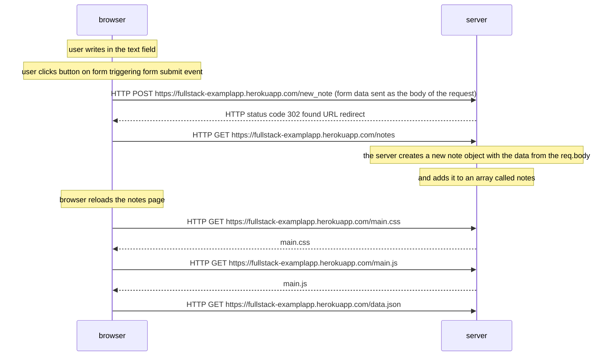

```mermaid
sequenceDiagram
    participant browser
    Note over browser: user writes in the text field
    Note over browser: user clicks button on form triggering form submit event
    participant server
     browser->>server: HTTP POST https://fullstack-examplapp.herokuapp.com/new_note (form data sent as the body of the request)
     server-->>browser: HTTP status code 302 found URL redirect
     browser->>server: HTTP GET https://fullstack-examplapp.herokuapp.com/notes
    Note over server: the server creates a new note object with the data from the req.body
    Note over server: and adds it to an array called notes
    Note over browser:  browser reloads the notes page
    browser->>server: HTTP GET https://fullstack-examplapp.herokuapp.com/main.css
    server -->>browser: main.css
    browser->>server: HTTP GET https://fullstack-examplapp.herokuapp.com/main.js
    server -->>browser: main.js

    browser->>server: HTTP GET https://fullstack-examplapp.herokuapp.com/data.json

```
