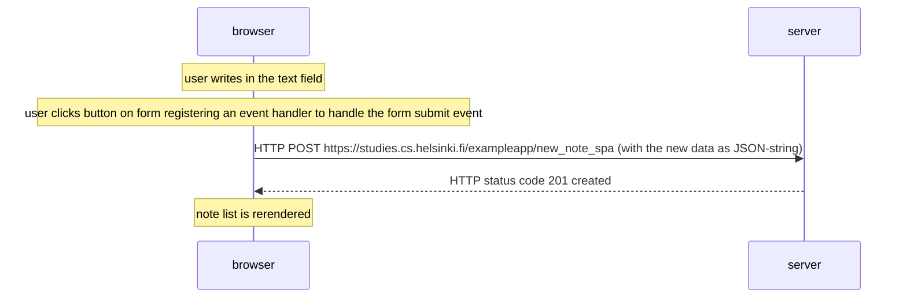

```mermaid
sequenceDiagram
  participant browser
  participant server
   Note over browser: user writes in the text field
   Note over browser: user clicks button on form registering an event handler to handle the form submit event
   browser->>server: HTTP POST https://studies.cs.helsinki.fi/exampleapp/new_note_spa (with the new data as JSON-string)
   server-->>browser: HTTP status code 201 created
   Note over browser: note list is rerendered
```
